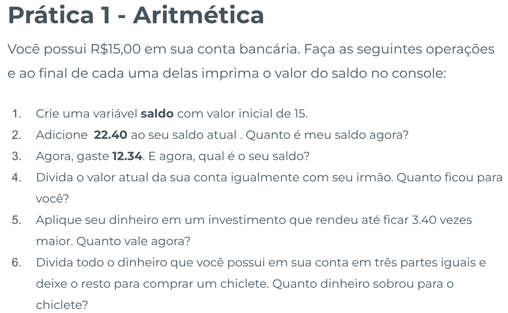
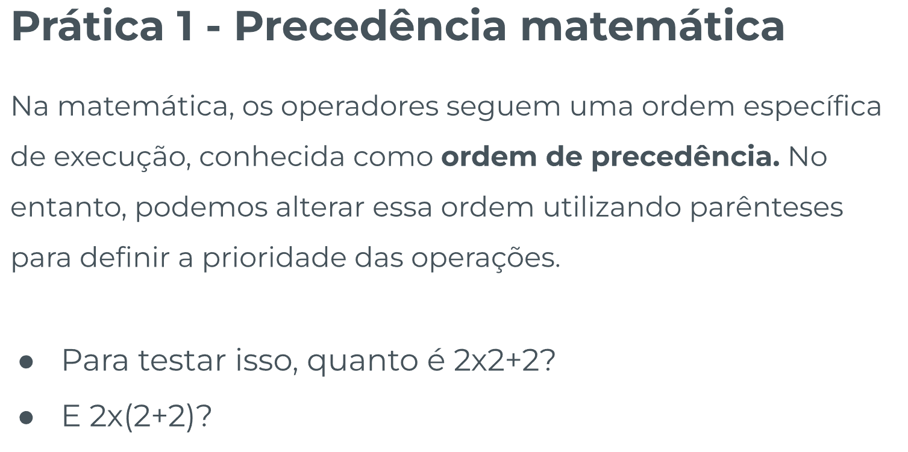
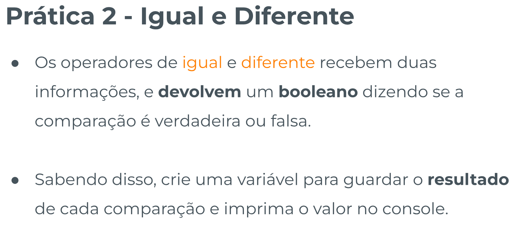
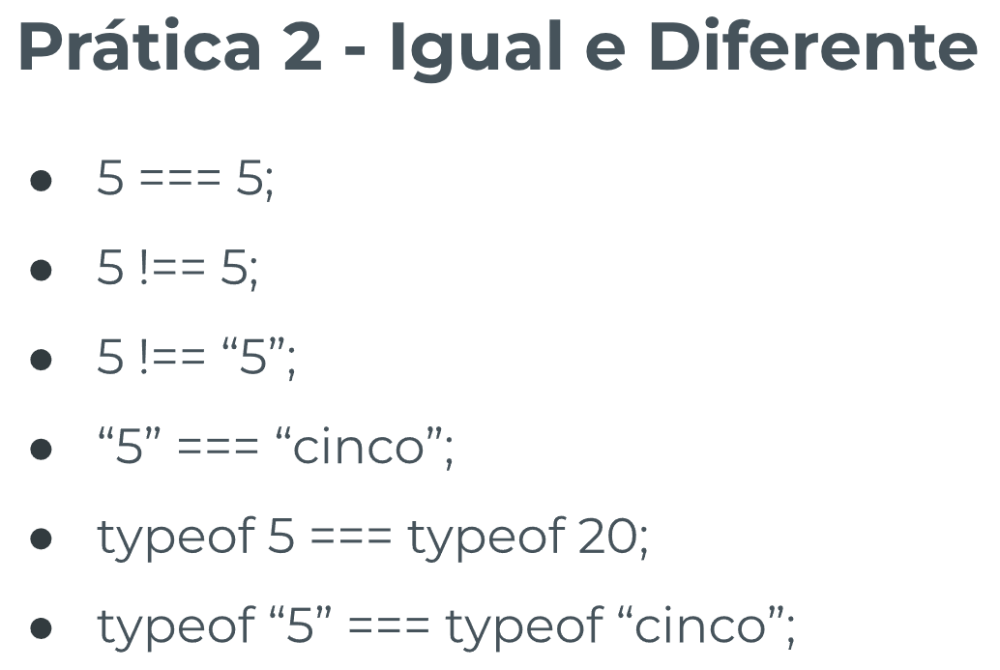
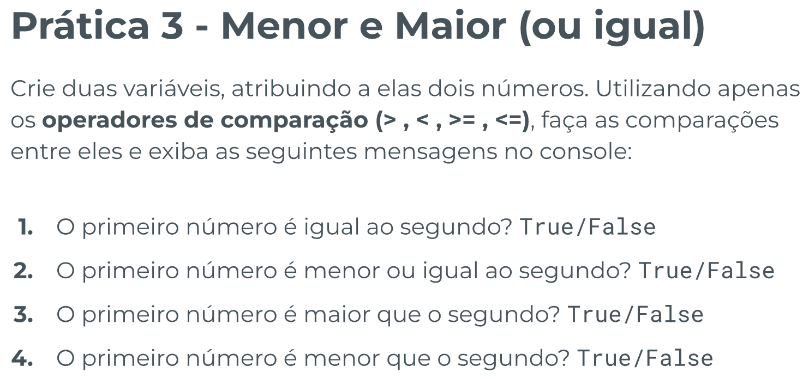
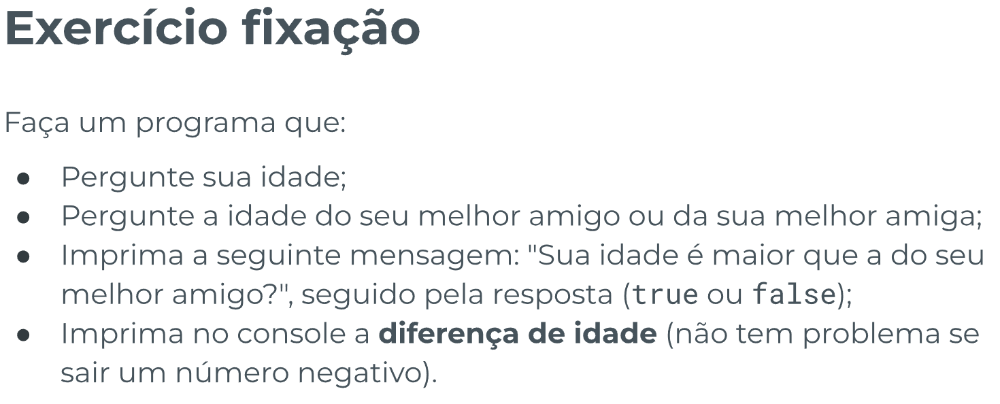

# Operadores - Template de Prática

## Índice

-   [Prática Guiada 1](#prática-guiada-1)

    -   [Enunciado](#enunciado)
    -   [Resolução](#resolução)

-   [Prática Guiada 2](#prática-guiada-2)

    -   [Enunciado](#enunciado-1)
    -   [Resolução](#resoluc3a7c3a3o-1)

-   [Prática Guiada 3](#prática-guiada-3)

    -   [Enunciado](#enunciado-2)
    -   [Resolução](#resoluc3a7c3a3o-2)

-   [Fixação](#fixação)

    -   [Enunciado](#enunciado-3)
    -   [Resolução](#resoluc3a7c3a3o-3)
    -   [Extra](#extra)

## Prática Guiada 1

[Voltar ao Topo](#índice)

### Enunciado





### Resolução

```js
// Prática Guiada 1

// Aritmética
let saldo;

saldo = 15;
saldo = saldo + 22.4;
console.log(`Após receber 22.40 eu tenho um total de: ${saldo}`);

saldo = saldo - 12.34;
console.log(`Após gastar 12.34 o meu saldo é de: ${saldo}`);

saldo = saldo / 3;
console.log(`Cada irmão ficou com ${saldo}`);

saldo = saldo * 3.42;
console.log(`Meu saldo após investimento é: ${saldo}`);

saldo = saldo % 3;
console.log(`Agora eu tenho ${saldo} para comprar meus dadinhos`);

//Precedência matemática
console.log(2 * 2 + 2);
console.log(2 * (2 + 2));
```

## Prática Guiada 2

[Voltar ao Topo](#índice)

### Enunciado





### Resolução

```js
// Pratica guiada 2

const resultado = 5 === 5;
console.log(`Comparação 1 ${resultado}`);

const resultado2 = 5 !== 5;
console.log(`Comparação 2: ${resultado2}`);

const resultado3 = 5 !== '5';
console.log(`Comparação 3: ${resultado3}`);

const resultado4 = '5' === 'cinco';
console.log(`Comparação 4: ${resultado4}`);

const resultado5 = typeof 5 === typeof 20;
console.log(`Comparação 5: ${resultado5}`);

const resultado6 = typeof '5' === typeof 'cinco';
console.log(`Comparação 6: ${resultado6}`);
```

## Prática Guiada 3

[Voltar ao Topo](#índice)

### Enunciado



### Resolução

```js
// PRATICA GUIADA 3
const primeiroNumero = 15;
// const segundoNumero = 15;
const segundoNumero = 24;

//Comparação 1
const compara1 = primeiroNumero === segundoNumero;
console.log(`O primeiro número é igual ao segundo?: ${compara1}`);
// false

//Comparação 2
const compara2 = primeiroNumero <= segundoNumero;
console.log(
    `O primeiro número é menor ou igual ao segundo número?: ${compara2}`
);
// true

// Comparação 3
const compara3 = primeiroNumero > segundoNumero;
console.log(`O primeiro número é maior que o segundo: ${compara3}`);
// false

// Comparação 4
const compara4 = primeiroNumero < segundoNumero;
console.log(`O primeiro número é menor que o segundo: ${compara4}`);
// true
```

## Fixação

[Voltar ao Topo](#índice)

### Enunciado



### Resolução

```js
const minhaIdade = Number(prompt('Qual sua idade?'));
const idadeAmiga = Number(prompt('Qual a idade da sua amiga ou amigo?'));

const calculoDaIdade = minhaIdade > idadeAmiga;

console.log(`Sua idade é maior que a do seu melhor amigo?: ${calculoDaIdade}`);

const diferencaDeIdade = idadeAmiga - minhaIdade;

console.log(`A diferença de idade é de: ${diferencaDeIdade} anos`);
```
